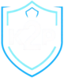

# K2P Portaria

  

Sistema web para gestão de **portaria**, **controle de liberações** (visitantes, prestadores, motoristas de app) e **gestão de encomendas**, com **notificações via WhatsApp** usando **n8n**.

> Escopo atual:
> - **Carros**: entrada por TAG já existente (fora do sistema), saída livre.
> - **Moradores**: entrada por biometria facial (equipamento do fornecedor), saída livre.
> - **Visitantes/Prestadores/Entregas/Motoristas**: liberação e validação via sistema + notificações pelo WhatsApp (n8n).

---

## Objetivos do sistema

- Permitir que **moradores liberem acessos** pelo WhatsApp (via n8n).
- Permitir que a **portaria valide a liberação** no momento da chegada e registre eventos.
- Notificar o morador quando:
  - um **visitante/prestador/motorista** chegou;
  - uma **encomenda** chegou;
  - uma encomenda foi **retirada** (com registro “entregue para quem”).
- Manter **auditoria** (quem fez o quê, quando) e histórico.

---

## Tecnologias recomendadas (100% Web + Servidor Local)

### Stack sugerida (recomendada)
**Front-end**
- Next.js (React) + TypeScript
- Tailwind CSS + shadcn/ui
- React Hook Form + Zod (validação)
- TanStack Query (cache e chamadas de API)

**Back-end**
- NestJS (TypeScript)
- Prisma ORM
- PostgreSQL
- Redis (opcional para filas e jobs)
- Armazenamento de fotos: S3 compatível (MinIO local recomendado)

**Autenticação**
- Keycloak (OIDC/OpenID Connect) — hospedado localmente
  - MFA opcional
  - gerenciamento central de usuários
  - emissão de tokens JWT para o sistema

**Integração**
- n8n para fluxos WhatsApp (webhooks + envio de mensagens)

> Por que Keycloak (vs auth Google)?  
> - Rodando em **servidor local**, com custo previsível e sem depender de MAU/serviço cloud.
> - Controle total de roles/usuários e integração OIDC padrão.

---

## Arquitetura (alto nível)

- **Web App (Next.js)**: portal para Portaria / Síndico / Moradores.
- **API (NestJS)**: regras de negócio, RBAC, auditoria, integrações e webhooks.
- **Postgres**: base de dados relacional.
- **Storage (MinIO/S3)**: fotos de encomendas e eventos (URLs no banco).
- **Keycloak**: login e emissão de tokens.
- **n8n**:
  - recebe webhooks do sistema (chegada de visitante/encomenda, baixa da encomenda)
  - envia mensagens via WhatsApp
  - recebe respostas do morador e chama endpoints do sistema

---

## Módulos do sistema

1. **Cadastros**
   - Condomínio (estrutura: blocos, unidades/apartamentos)
   - Pessoas (moradores, portaria/funcionários, prestadores — quando necessário)
   - Veículos (registro informativo, sem controlar TAG)

2. **Autorizações de Acesso**
   - Tipos: `VISIT`, `SERVICE`, `DELIVERY`, `RIDEHAIL`
   - Validade por janela de tempo (ex.: 14h–18h, ou dias)
   - **Reentrada ilimitada** dentro do período (visitante pode entrar/sair quantas vezes precisar)
   - Portaria registra eventos (chegada, entrada autorizada/negada, etc.)

3. **Encomendas**
   - Portaria cadastra com **foto do que chegou**
   - Sistema notifica o morador via n8n/WhatsApp
   - Retirada: portaria dá baixa e registra **para quem foi entregue**
   - n8n envia confirmação da entrega

4. **Eventos e Auditoria**
   - Eventos operacionais: chegada/entrada/saída (quando aplicável), entrega de encomenda
   - Auditoria administrativa: criação, cancelamento, baixa, edição de cadastro

---

## Perfis de Usuário (RBAC)

### Papéis (roles) padrão
- **ADMIN_CONDOMINIO**: administração global do condomínio no sistema.
- **SINDICO**: gestão operacional/relatórios e supervisão.
- **PORTARIA**: validações na entrada, cadastros operacionais, encomendas.
- **MORADOR**: cria autorizações e consulta informações da sua unidade.

### Escopos (multi-tenant / segurança por contexto)
- Todo usuário pertence a um `condominium_id`.
- Morador tem também `unit_id` (escopo de unidade).
- Portaria/Síndico/Admin enxergam todo o condomínio (com permissões).

---

## Permissões sugeridas (matriz)

| Ação / Módulo | ADMIN | SÍNDICO | PORTARIA | MORADOR |
|---|---:|---:|---:|---:|
| Gerir estrutura (blocos/unidades) | ✅ | ⚠️ (opcional) | ❌ | ❌ |
| Gerir usuários e perfis | ✅ | ⚠️ (opcional) | ❌ | ❌ |
| Criar liberação (VISIT/SERVICE/DELIVERY/RIDEHAIL) | ✅ | ✅ | ⚠️ (casos especiais) | ✅ (somente própria unidade) |
| Cancelar liberação | ✅ | ✅ | ✅ | ✅ (somente próprias) |
| Consultar liberação na portaria | ✅ | ✅ | ✅ | ✅ (somente próprias) |
| Registrar “chegada” (visitante/prestador/motorista) | ✅ | ✅ | ✅ | ❌ |
| Decisão do morador (SIM/NÃO) na chegada | ❌ | ❌ | ❌ | ✅ |
| Cadastrar encomenda (com foto) | ✅ | ✅ | ✅ | ❌ |
| Dar baixa de encomenda (entregue) | ✅ | ✅ | ✅ | ❌ |
| Ver relatórios (eventos, encomendas, autorizações) | ✅ | ✅ | ✅ (limitado) | ✅ (limitado à unidade) |

✅ permitido | ⚠️ depende de política interna | ❌ não permitido

---

## Fluxos principais

### 1) Visitantes / Prestadores / Motoristas / Entregadores

**Criação (morador via WhatsApp / n8n)**
1. Morador informa: pessoa, unidade, período, tipo (VISIT/SERVICE/DELIVERY/RIDEHAIL), observações.
2. n8n chama `POST /authorizations` (API).
3. API retorna `release_code` e status `APPROVED`.
4. n8n confirma ao morador e guarda o contexto.

**Chegada na portaria**
1. Portaria busca por `release_code` ou CPF/nome/placa.
2. Portaria registra evento `ARRIVED` (chegada).
3. API dispara webhook para n8n: “pessoa X chegou”.
4. n8n envia WhatsApp ao morador pedindo confirmação (SIM/NÃO).
5. Morador responde e n8n chama `POST /authorizations/{id}/host-decision`.
6. Portaria vê status atualizado e prossegue.

> Regra: o visitante pode entrar/sair quantas vezes precisar enquanto estiver dentro do período válido.

---

### 2) Encomendas

**Chegada**
1. Portaria cadastra encomenda com foto (`POST /portaria/packages`).
2. API salva registro e chama webhook no n8n (package-received).
3. n8n envia WhatsApp ao morador: “chegou encomenda, retire na portaria”.

**Retirada**
1. Portaria dá baixa (`POST /portaria/packages/{id}/deliver`), informando “entregue para”.
2. API registra evento e chama webhook no n8n (package-delivered).
3. n8n envia WhatsApp ao morador: “encomenda entregue para X”.

---

## Integração com n8n (padrão)

### Webhooks do sistema → n8n
- `authorization-arrived` (chegada de pessoa na portaria)
- `package-received` (encomenda cadastrada)
- `package-delivered` (encomenda baixada)

### Chamadas do n8n → sistema
- `POST /authorizations` (criar liberação)
- `POST /authorizations/{id}/host-decision` (SIM/NÃO do morador)
- `GET /authorizations?unit_id=...` (consulta rápida para responder “minhas liberações”)
- `GET /packages?unit_id=...&status=RECEIVED` (encomendas pendentes)

**Segurança recomendada**
- Webhooks assinados (HMAC) ou token longo por endpoint.
- Rate limit e logs de chamada.

---

## Fotos (encomendas e evidências)
- Fotos devem ir para um storage (MinIO/S3).
- O banco armazena apenas `photo_url`.
- Upload recomendado:
  1) Front pede URL pré-assinada (`POST /uploads/presign`)
  2) Front envia arquivo direto ao storage
  3) Front envia a URL ao endpoint de cadastro (encomenda/registro)

---

## Deploy local (Docker recomendado)

### Componentes mínimos
- Postgres
- Keycloak
- (Opcional) Redis
- (Recomendado) MinIO
- API (NestJS)
- Web (Next.js)
- n8n (pode rodar na mesma máquina ou outra)

> Observação: o n8n pode ficar no mesmo host do sistema; se ficar separado, configure rede e TLS.

---

## Estrutura sugerida de repositório